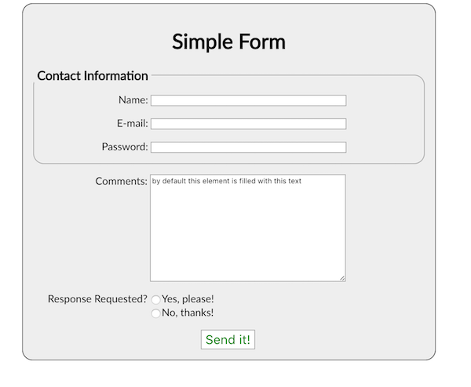
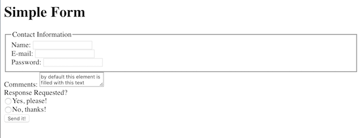

# Week 8 Thursday Exercise: HTML Forms (23 March 2017)

## Overview & Goals
In today's exercise, you'll build a basic HTML form with a variety of input types, and then style it using CSS.   

## Previewing What You're Going to Make
Your finished form should look like this:

 

## Setting Up
Your HTML and CSS files for this exercise will go into a week8b directory in your igme230 directory. You'll be creating an index.html file for the form itself, and a form.css stylesheet for the formatting. 

## HTML Form
As usual, you need to start your page with basic html structure, including a link to the stylesheet you'll be creating. I also added a link to the Google font I used for my example form. Choose a sans-serif font to use for your form--if it's a system font like Helvetica or Arial, you won't need to add a CSS link, but if you're using a web-based font you should add it now. 

Inside the body, you'll put a form element, which will hold all of your form content. 

```html
<!DOCTYPE html>
<html lang="en">
<head>
    <meta charset="UTF-8">
    <meta name="viewport" content="width=device-width, initial-scale=1, maximum-scale=1.0" />
    <title>Basic HTML Form</title>
    <link href="https://fonts.googleapis.com/css?family=Lato" rel="stylesheet">
    <link rel="stylesheet" href="form.css">
</head>
<body>
    <form>

    </form>
</body>
</html>
```

At the top of the form, you'll add an `<h1>` element with the title for the form. 

Below that, you'll add a `<fieldset>` element with a `<legend>` of "Contact Information.

Inside the fieldset, you'll put three input fields--one for plain text entry of a name, one for email, and one for a password. The input fields have three attributes:
- "type" specifies what type of input the field is used for
- "id" allows us to access that element using Javascript (which is important for form validation)
- "name" is used to collect the data from the form; every input needs a name and a value

Each of the input fields also needs a label identifying it. 

Wrap each of the label/input combinations in `<div>` tags so that we can format them easily when we start changing styles. 

```html
<h1>Simple Form</h1>
    <fieldset>
        <legend>Contact Information</legend>

        <div>
            <label for="name">Name: </label>
            <input type="text" id="name" name="username">
        </div>

        <div>
            <label for="mail">E-mail: </label>
            <input type="email" id="mail" name="usermail">
        </div>

        <div>
            <label for="password">Password: </label>
            <input type="password" id="pwd" name="password">
        </div>
    </fieldset>
```

Below the fieldset, add another div for the Comments input. It also needs both a `<label>` and a method for inputting data, but this time instead of a single-line text `<input>` element, we're going to use the multi-line `<textarea>` element. 

```html
<div>
    <label for="comments">Comments: </label>
    <textarea id="comments" name="comments">by default this element is filled with this text</textarea>
</div>
```

Our last input field is going to be a pair of radio buttons. With radio buttons and checkboxes, you need to assign the same name attribute to each of the inputs, so that the browser knows to treat them as related options. 

```html
<div>
    <label for "response">Response Requested?</label>
    <ul>
        <li><input type="radio" name="response" value="yes">Yes, please!</li>
        <li><input type="radio" name="response" value="no">No, thanks!</li>
    </ul>
</div>
```

Finally, we need to add a submit button at the end of the form. 

```html
<div>
    <button type="submit">Send it!</button>
</div>
```

Take a look at the form now in a browser. It should show you all of the fields, but it won't be very pretty!

 


## CSS Formatting

Now you need to use form.css to make the form more attractive and usable. Start by defining a sans-serif font family for the entire page: 

```css
body {
    font-family: Lato;
    }
```

Now format the form itself to a have a set width, gray background, black border, and rounded corners. Set the margins to `0 auto` so that the form is centered on the page, and give it some interior padding. Then center the text of the heading. 

```css
form {
    width: 600px;
    border: 1px solid #000;
    border-radius: 1em;
    background-color: #eee;
    margin: 0 auto;
    padding: 1em;
}

h1 { text-align: center; }
```

Next you'll format the fieldset, specifying a gray border with rounded borders instead of the default black square, and adding some space above it. Make the legend for the fieldset a bit bigger, too. 

```css
fieldset {
    border: 1px solid #999;
    border-radius: 1em;
    margin: 20px 0 0 0;
    padding: 0;
    }

legend {
    font-size: 1.2em;
    font-weight: bolder;
    padding: 0px 5px;
    }
```

You want to space the input items out a bit more vertically. Since they're each contained in a div, we can change the margin for divs to add some extra space above and below:

```css
div {
  margin: 1em 0;
  padding: 0;
}
```

Next, you need to change the alignment of the input items so that the labels are right-aligned, creating a clean line of inputs. Because the labels are inline items rather than block items, their text alignment can't be modified. However, there's a special display type of "inline-block" that keeps an item in the inline flow, but allows you to manipulate its properties as though it was a block-level item. If you use that, you can set the labels to a fixed width, and then align their content to the right without breaking the flow of the content: 

```css
label {
    display: inline-block;
    width: 175px;
    text-align: right;
}
```

You also should change the width of the input and textarea fields so that they all have the same width and border:

```css
input, textarea {
  width: 300px;
  border: 1px solid #999;
}
```

Take a look at the form now in the browser. The top part of the form should look fine, but the bottom still needs some work!

You want the top, not the bottom, of the textarea input field to line up with the label, which you can do by changing the `vertical-align` property. Make the field a bit taller, too, to be more welcoming to type in:

```css
textarea {
  vertical-align: top; 
  height: 15em;
}
```

Now you need to tackle the radio buttons. Unlike the other input fields, they have a label for the group rather than for the indvidual items, and the text for the options needs to come after the button rather than before it. As a result, you don't want the buttons to have the same 300px width as the other input fields, because that separates them from the text that follows them. To fix that, you need to change the width of only the input fields with a type of `radio`, using an attribute selector:

```css
input[type=radio] {
    width: auto; 
}
```

The radio buttons are in an unordered list, and you don't want it to have bullets, so you'll need to change the list-style to none. You also need to change the display type of the list from its default of block (which pushes it to a new line) to the inline-block style we used for the labels, and then vertically align it in the same way you did for the `<textarea>` field. 

```css
ul {
    margin: 0;
    padding: 0;
    list-style: none;
    display: inline-block;
    vertical-align: top; 
}
```

Take a look at it now--it's almost done! All that's left is the button. 

In my example, the button is white with large green text, but it changes to green with white text when you hover over it. Also, to make it more obvious that the button is clickable, I changed the curser to a pointer rather than an arrow. . 

```css
button {
    border: 1px solid #999;
    background-color: white;
    color: green; 
    margin:auto;
    font-size: 1.2em;
}

button:hover {
    background-color: green; 
    color: white;
    cursor: pointer;
}
```

Only one last thing to do. The button needs to be centered on the page. You could add a CSS class or ID to the div containing the button so that you could change the text alignment, but there's a way to do this that doesn't involve modifying the HTML at all.

You can create a selector that uses the `:last-child` pseudo class to select the last element of a particular type. However, that creates a small problem. Try it, and then reload the page: 

```css
div:last-child {
    text-align: center;
}
```

You'll see that it did indeed center the last div on the page, putting the submit button where you wanted it. However, it *also* centered the last div inside the fieldset, because those three divs are all siblings, as well. 

To fix that problem, we need to change the rule so that it only selects divs that are the direct children of the form--that will exclude the fieldset divs. 

```css
form>div:last-child {
    text-align: center;
}
```

And that's it! You're done!


## Submitting Your Work
Upload the entire week8b folder to your igme230 folder on Banjo, and ***link to it from your main page.*** It should load properly at people.rit.edu/youruserid/igme230/week8b/ . It must be submitted by noon tomorrow (Friday, March 24).


